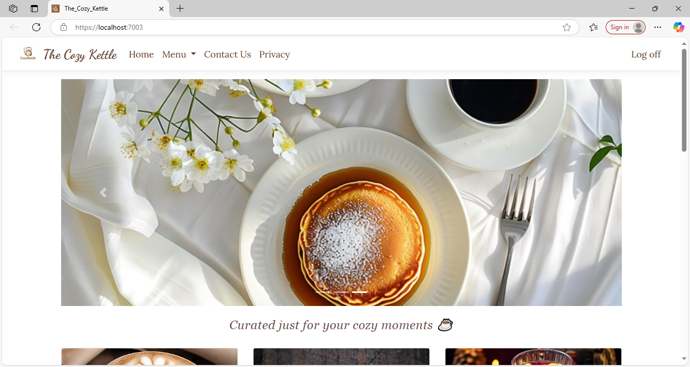

# CozyKettleApp
Cozy Kettle is a web app built with .NET 8 MVC that lets users browse coffee and refreshers and place orders with ease. This repository contains the code for the website, offering a seamless and cozy ordering experience straight to your doorstep.

## 📸 Screenshots

### ☕ App Logo / Welcome Screen



### 🏠 Home Page


### 🔐 Login Page


### 🛒 Checkout Page


### 🧾 Order Completion Page


## 🎥 Demo Video

[](https://youtu.be/Uu1ywc9769M)


## 🚀 Features

- 👤 User registration, login, and authentication 
- 🛒 Shopping cart with quantity adjustment and item removal
- 🔍 Product search, category filtering
- 🖼️ Responsive UI with Bootstrap 5
- 🗄️ Entity Framework Core 8 with Code-First Migrations


## 🛠️ Tech Stack

- ASP.NET Core 8 MVC
- C# and .NET 8 SDK
- Entity Framework Core
- SQL Server / LocalDB
- Bootstrap 5
- JavaScript / jQuery
- ASP.NET Identity


## 🧰 Getting Started

### Prerequisites

- [.NET 8 SDK](https://dotnet.microsoft.com/en-us/download/dotnet/8.0)
- SQL Server (Express or LocalDB)
- Visual Studio 2022+ or Visual Studio Code

### Installation

1. **Clone the repository**

```bash
git clone https://github.com/yourusername/CozyKettleApp.git
cd CozyKettleApp


📬 Contact
For questions, feedback, or collaboration:

GitHub: aswathy2892

Email: aswathyasokan2892@gmail.com


